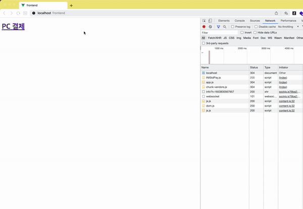

# vue - springboot 이니시스 결제 모듈 연동



# 1. 환경
### 1) 프론트엔드
- vue - 2.6.1
- npm
- node - v16.15.0

### 2) 백엔드
- springboot - 2.7.0
- java 11
- 의존성 - lombok, mustache


# 2. 실행
### 1) springboot
```
루트 디렉토리 임포트 후

main 함수 실행
```

### 2) vue
```
frontend 폴더로 이동

npm i

npm run serve
```

# 3. 참고
### 1) 블로그
https://skyepodium.tistory.com/entry/vue-springboot-%EC%9D%B4%EB%8B%88%EC%8B%9C%EC%8A%A4-%EA%B2%B0%EC%A0%9C-%EB%AA%A8%EB%93%88-%EC%97%B0%EB%8F%99

### 2) 이니시스 문서
https://manual.inicis.com/stdpay/